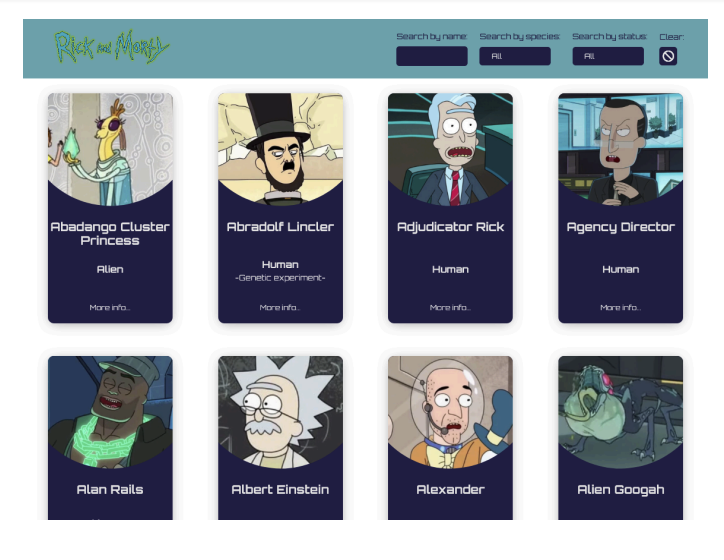

# Prueba Técnica React-Native
### Test Description
The test involves developing a Single Page Application (SPA) that lists characters from Rick and Morty.

The API from which the data will be retrieved is https://rickandmortyapi.com/api, and its documentation is available at https://rickandmortyapi.com/documentation/#rest. Use the REST version of the API.

### Requirements
To adequately evaluate the frontend work, we will need some basic points covered, as well as some desirable features to properly assess the developed application.

### Minimum Requirements
- [ ] Create a list of Rick and Morty characters.
- [ ] The list should display 10 characters.
- [ ] Add pagination or a "load more" button.
- [ ] Create a filter area that at least filters by name.
- [ ] Create a view that shows information about a single character with detailed information.

### Optional Requirements
- [ ] Implement some type of cache in the API calls.
- [*] Implement the following tools in the project: eslint, prettier. This will provide error management through eslint and uniform formatting for the entire project with prettier.

### Features to Evaluate
- [ ] Testing of at least one component.
- [ ] Use animations with react-native-reanimated or another preferred library.
- [ ] Careful layout design.
- [ ] Best practices.
- [ ] Clean code.

### *The design is up to the candidate.*

### Key Points
- [ ] Design should be adaptable to both Android and iOS.
- [ ] Do not use interface design frameworks like Tailwind, Bootstrap, etc.
- [ ] Use CSS, SCSS, or preferably styled-components or @emotion/styled.
